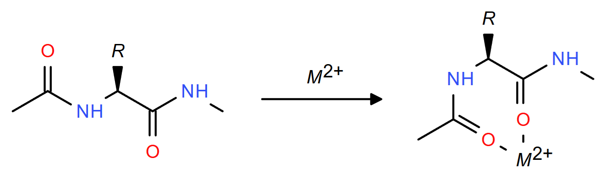
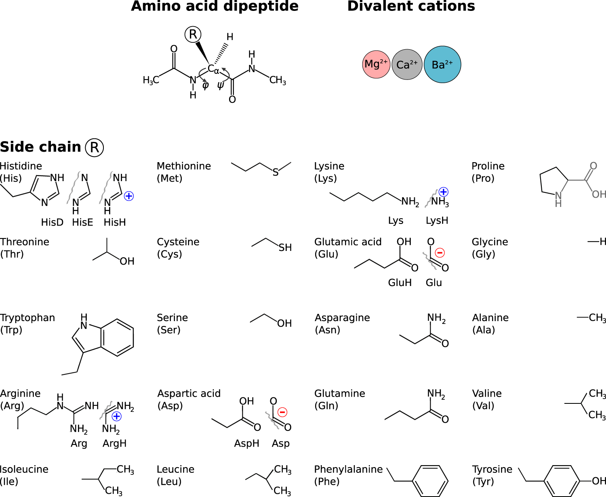

# Coordination-Informed Protein Embedings

This repository introduces a novel approach that employs property-based protein embeddings,
with a particular focus on the role of double-charged cations such as Ca2+ and Mg2+.

In this framework, each amino acid is assigned not only standard cheminformatics descriptors
but also the interaction energies Mg2+, Ca2+, and Ba2+,
aiming to enhance machine learning applications in protein characterization.

In this repository, we provide the interaction energy values for ions with amino acids that were utilized in our research.
We believe these data will be valuable for researchers in cheminformatics and related fields,
facilitating further exploration and application in protein studies.

## [Dataset](data_processing/data/energies_final.csv)

This dataset comprises a table where each row corresponds to an amino acid,
and the columns represent the interaction energies between
the amino acids and double-charged cations in the gas phase (see Figure 1).

*Figure 1. Reaction corresponding to the provided interaction energies*

For amino acids with potentially ionic side chains, both neutral and charged forms were considered:
cationic forms for Lysine (Lys), Arginine (Arg), and Histidine (His);
and anionic forms for Aspartic acid (Asp) and Glutamic acid (Glu). 
One can chose one the more effective one for their needs.
The authors believe that using the charged-sidechains version enhances the diversity of the final vectors,
thereby improving their effectiveness as machine learning descriptors.

**Table 1. Relative interaction energies between aminoacids and double-charged ions, eV.**

Aminoacid | Eint(Mg2+), eV | Eint(Ca2+), eV | Eint(Ba2+), eV | Eint(Mg2+), charged sidechains, eV | Eint(Ca2+), charged sidechains, eV | Eint(Ba2+), charged sidechains, eV
:---: | ----: | ----: | ----: | ----: | ----: | ----:
A |   -0.138 |   -0.119 |   -0.100 |   -0.138 |   -0.119 |   -0.100
R |   -3.225 |   -2.128 |   -1.599 |    4.481 |    4.391 |    4.303
N |   -1.800 |   -1.256 |   -0.896 |   -1.800 |   -1.256 |   -0.896
D |   -1.327 |   -0.832 |   -0.510 |   -8.706 |   -8.138 |   -7.616
C |   -0.880 |   -0.458 |   -0.233 |   -0.880 |   -0.458 |   -0.233
Q |   -2.365 |   -1.721 |   -1.322 |   -2.365 |   -1.721 |   -1.322
E |   -1.717 |   -1.121 |   -0.901 |   -8.961 |   -8.331 |   -7.763
G |    0.000 |    0.000 |    0.000 |    0.000 |    0.000 |    0.000
H |   -2.354 |   -1.602 |   -1.211 |    5.551 |    5.390 |    5.227
I |   -0.638 |   -0.348 |   -0.270 |   -0.638 |   -0.348 |   -0.270
L |   -0.603 |   -0.306 |   -0.268 |   -0.603 |   -0.306 |   -0.268
K |   -2.453 |   -1.508 |   -1.116 |    4.784 |    4.693 |    4.603
M |   -1.635 |   -0.978 |   -0.653 |   -1.635 |   -0.978 |   -0.653
F |   -1.640 |   -1.262 |   -0.950 |   -1.640 |   -1.262 |   -0.950
P |   -0.347 |   -0.304 |   -0.250 |   -0.347 |   -0.304 |   -0.250
S |   -0.972 |   -0.578 |   -0.323 |   -0.972 |   -0.578 |   -0.323
T |   -1.729 |   -0.720 |   -0.441 |   -1.729 |   -0.720 |   -0.441
W |   -2.153 |   -1.679 |   -1.347 |   -2.153 |   -1.679 |   -1.347
Y |   -1.773 |   -1.381 |   -1.047 |   -1.773 |   -1.381 |   -1.047
V |   -0.489 |   -0.271 |   -0.224 |   -0.489 |   -0.271 |   -0.224
O |   -2.475 |   -1.718 |   -1.330 |    0.939 |    0.899 |    1.638
U |   -1.266 |   -0.770 |   -0.527 |   -1.185 |   -1.175 |   -0.981

## [Data processing](data_processing/)

The original data on interaction energies between amino acids and double-charged ions were published in [Nature Scientific Data](https://www.nature.com/articles/sdata20169).
The raw data was sourced from the [NOMAD database](https://nomad-lab.eu/prod/v1/gui/search/entries?datasets.dataset_name=Cation-coordinated%20conformers%20of%2020%20proteinogenic%20amino%20acids%20with%20different%20protonation%20states).

The dataset models amino acids with the following modifications (**Figure 2**):
- The carboxylic acid (-COOH) group is transformed to an amide (-CONHMe).
- The α-amino group (-NH2) is acylated to form an amide (-NHCOMe).
- Both neutral and charged states are considered for potentially ionic side chains:
    - cationic forms for Lysine (Lys), Arginine (Arg), and Histidine (His);
    - anionic forms for Aspartic acid (Asp) and Glutamic acid (Glu).
- All computations were performed in the gas phase.

*Figure 2. Modified aminoacids structures*

The dataset includes all identified conformers for these 20 amino acids in both free and bound states (complexes with Mg, Ca, Ba).
For this repository, we have used the lowest energy conformer for each system.

For detailed information on the data extraction process, please refer to the [data_processing](data_processing/).

