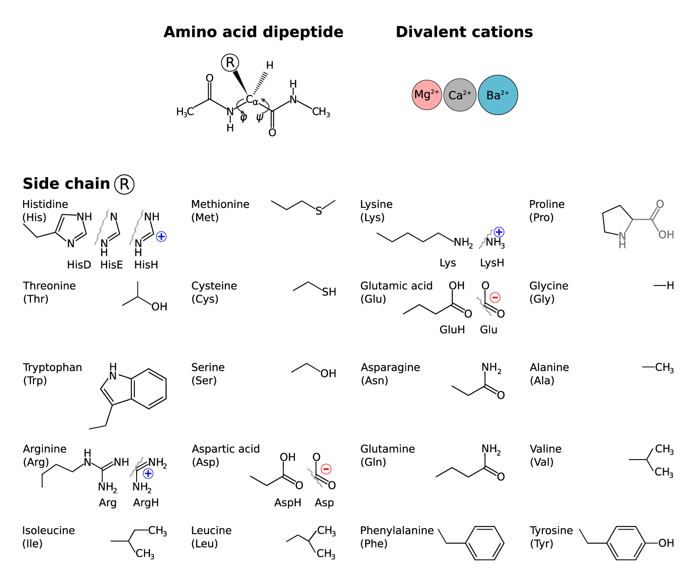

# Coordination-informed-protein-descriptors

The protein drug market is extremely expanding.
It is estimated to reach almost four billion dollars by 2028.
At the same time, the share of biopharmaceuticals on the market is also growing from year to year. 
Such growth is associated with significant selectivity and efficiency of protein drugs,
which are explained by their unique configurations - protein structures folding.

Today exist two approaches: structure- and sequence-based models.
In sequence-based models a protein is represented by a symbolic sequence of amino acids.
In the structure-based models a protein is represented as a set of geometry characteristics –
atoms coordinates and distances between them. 

But both methods have a big common disadvantage -
they do not take into account chemical and coordination interactions.
Due to this fact, they are not effective enough,
their use does not have a strong impact on the cost of research.

But Protein folding and therefore their properties depend not only on sequence
but also on coordination by other compounds.
And double-charged ions have shown to play crucial roles in these processes.
In particular, calcium and magnesium cations, which are widely represented in the living organisms

That’s why we decided to develop new method to describe proteins in ML thorough coordination-informed descriptors.  

We offer descriptive characteristics based on chemical interactions approach.
Our method relies on the interactions of dipeptides with calcium and magnesium cations;
proteins are described as an intersecting sequence of dipeptides. As the result we will obtain the set of digital characteristics for any protein. Moreover, the set sizes will be the same for protein of any length

## Dataset

This dataset comprises a table where each row corresponds to an amino acid,
and the columns represent the interaction energies between
the amino acids and double-charged cations in the gas phase (see Figure 1).

*Figure 1. Reaction corresponding to the provided interaction energies*

For amino acids with potentially ionic side chains, only charged forms were considered:
cationic forms for Lysine (Lys), Arginine (Arg), and Histidine (His);
and anionic forms for Aspartic acid (Asp) and Glutamic acid (Glu). 
This approach was adopted to enhance the diversity of the final vectors,
thereby improving their effectiveness as machine learning descriptors.

**Table 1. AA-M2+ Interaction energies, kJ/mol.**

## [Data processing](data_processing/)

The original data on interaction energies between amino acids and double-charged ions were published in [Nature Scientific Data](https://www.nature.com/articles/sdata20169).
The raw data was sourced from the [NOMAD database](https://nomad-lab.eu/prod/v1/gui/search/entries?datasets.dataset_name=Cation-coordinated%20conformers%20of%2020%20proteinogenic%20amino%20acids%20with%20different%20protonation%20states).

The dataset models amino acids with the following modifications (**Figure 2**):
- The carboxylic acid (-COOH) group is transformed to an amide (-CONHMe).
- The α-amino group (-NH2) is acylated to form an amide (-NHCOMe).
- Both neutral and charged states are considered for potentially ionic side chains:
    - cationic forms for Lysine (Lys), Arginine (Arg), and Histidine (His);
    - anionic forms for Aspartic acid (Asp) and Glutamic acid (Glu).
- All computations were performed in the gas phase.

*Figure 2. Modified aminoacids structures*

The dataset includes all identified conformers for these 20 amino acids in both free and bound states (complexes with Mg, Ca, Ba).
For this repository, we have used the lowest energy conformer for each system.

For detailed information on the data extraction process, please refer to the [data_processing](data_processing/).

